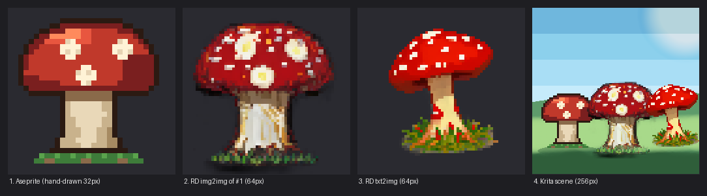

# pixelworks — MCP server for pixel-art toolchains

A single [Model Context Protocol](https://modelcontextprotocol.io/) server
(stdio transport) that consolidates three creative subsystems into one tool
surface, so an LLM client can drive an entire pixel-art workflow:

| Family | Count | Backing subsystem |
| --- | --- | --- |
| `rd_*` | 31 | **Retro Diffusion** — mostly the **locally run Stable Diffusion finetuned model** shipped inside the Retro Diffusion *Aseprite extension* (v15.0.0, WebSocket JSON on `ws://127.0.0.1:8765`); the **online** version (retrodiffusion.ai cloud API) is also supported through the four `rd_api_*` tools |
| `ase_*` | 95 | **Aseprite** workbench driven through the headless CLI — pixel read/write, shapes, dithering, flood fill, selection + clipboard, outline/shading, palettes + retro presets/ramps/quantization, frames/layers/tags, layer management & blend modes, cel tweening/oscillation, slices (9-patch), tilemaps, onion-skin/frame-diff/color-stats analysis, transforms, color modes, sprite-sheet/per-layer/per-tag export, raw-Lua escape hatch |
| `krita_*` | 39 | **Krita** over its MCP plugin HTTP API — painting (canvas, brushes, strokes, shapes, colors), layer tree management, pixel PNG bridge in/out, crash-free Pillow adjustments (invert/hsv/blur/…), filter catalog, selections, canvas transforms, per-layer export, view control, and QAction/run_python escape hatches |
| `px_*` | 4 | Capability/status probes and image-return helpers (`px_capabilities`, `px_view_image(s)`, `px_image_base64`) |

169 tools total. In MCP clients they surface as `mcp__pixelworks__<tool>`
(or just `<tool>`, depending on the client).

Each subsystem is **independently gated**: if one is unavailable, its tools
return `{"available": false, "subsystem": ..., "error": ..., "hint": ...}`
instead of raising, so the rest keeps working and the caller learns what to do
(e.g. run `rd_start_backend`). Call `px_capabilities` any time for a one-shot
overview of what is currently up.

> Developed and tested on Windows 10/11 with Python 3.12, Aseprite 1.3.18 and
> Retro Diffusion extension 15.0.0. macOS and Linux are **untested**: the
> code has no Windows-only dependencies and the platform paths are handled,
> so it is expected to work — see [macOS / Linux notes](#macos--linux-notes)
> for what to adjust and what to watch for.

---

## Prerequisites

1. **Python 3.10+** (developed on 3.12). [Download from python.org](https://www.python.org/downloads/)
   if you don't have it. Make sure to check **"Add Python to PATH"** during
   installation, or know where your Python executable lives.
2. **Aseprite 1.3+** — required for the `ase_*` tools. Note the path to the
   executable (`Aseprite.exe` on Windows;
   `/Applications/Aseprite.app/Contents/MacOS/aseprite` on macOS; the
   `aseprite` binary from Steam or your own build on Linux).
3. **Retro Diffusion Aseprite extension v15.0.0** — required for the local
   `rd_*` tools. This is a paid product ([purchase on
   itch.io](https://astropulse.itch.io/retrodiffusion/purchase)) that ships the
   locally run Stable Diffusion finetuned pixel-art model, its own backend
   (`image_server.py`) and a private venv under
   `<extension dir>\stable-diffusion-aseprite\`. Install it through
   Aseprite normally; the default location is
   `%APPDATA%\Aseprite\extensions\RetroDiffusion` on Windows,
   `~/Library/Application Support/Aseprite/extensions/RetroDiffusion` on
   macOS and `~/.config/aseprite/extensions/RetroDiffusion` on Linux.
4. *Optional* — the **online version** of Retro Diffusion
   (retrodiffusion.ai) is supported as an alternative to the local model: a
   **retrodiffusion.ai API key** enables the four cloud tools
   (`rd_api_txt2img`, `rd_api_img2img`, `rd_api_txt2anim`,
   `rd_api_img2anim`). If you already entered the key in the Retro Diffusion
   dialog inside Aseprite, the server picks it up from there automatically
   (see `RD_API_KEY` below).
5. *Optional* — **Krita 5.x with the bundled bridge plugin installed**
   (`krita-plugin/` in this repo; HTTP API on `localhost:5678`), only for
   the `krita_*` tools.

You do **not** need the RD backend or Krita running to start the server —
subsystems are probed lazily and gate themselves.

## Installation

### 1. Get the code and set up a Python virtual environment

Either clone:

```bash
git clone https://github.com/jmorais1988/pixelworks-mcp.git pixelworks
cd pixelworks
```

or download `pixelworks-mcp-<version>.zip` from the
[Releases page](https://github.com/jmorais1988/pixelworks-mcp/releases),
extract it, and `cd` into the extracted folder (a `.sha256` file is
published alongside each zip if you want to verify the download). The zip
contains exactly the files listed under *Repository layout*; the steps
below are identical for both.

A virtual environment (venv) keeps pixelworks' dependencies isolated from your
system Python:

```bash
# Create the virtual environment
python -m venv .venv

# Activate it
# Windows (Command Prompt):
.venv\Scripts\activate
# Windows (PowerShell):
.venv\Scripts\Activate.ps1
# macOS/Linux:
source .venv/bin/activate

# Install dependencies
pip install -r requirements.txt
```

> **Troubleshooting:** If `python` is not recognized, either add Python to
> your system PATH (re-run the installer and check "Add Python to PATH"), or
> use the full path to your Python executable, e.g.
> `"C:\Users\YOU\AppData\Local\Programs\Python\Python312\python.exe" -m venv .venv`.

`requirements.txt` pins `fastmcp==4.0.3` (the standalone fastmcp 4 package —
the server uses its tool registry and `fastmcp.utilities.types.Image`) plus
`websockets`, `pillow` and `httpx` (upper-bounded to the majors that were
tested; the exact verified versions are listed in the file).

**Alternative — pip install:** the folder is also a package. Inside the
activated venv, `pip install .` installs the same dependencies and a
`pixelworks` console command (`.venv\Scripts\pixelworks.exe` on Windows)
that you can use as the MCP client's `command` instead of
`python server.py`. `pip install -e .` keeps it editable.

### 2. Configure paths (important)

`server.py` reads its configuration from environment variables. The defaults
match a standard Windows install (the RD extension under `%APPDATA%`); set the
variables when your layout differs — `ase_status` / `px_capabilities` tell you
which path failed to resolve.

Aseprite itself is discovered automatically, including installs outside the
system drive (a *Program Files* on `D:`, a Steam library on another disk).
Set `ASEPRITE_EXE` when you have several installs and want to pin one, or when
Aseprite lives somewhere unusual:

| Variable | Default | Purpose |
| --- | --- | --- |
| `ASEPRITE_EXE` | Auto-detected: first existing of the Windows uninstall registry entry, `Aseprite` on `PATH`, `Aseprite\Aseprite.exe` under *Program Files* / *Program Files (x86)* / the root of **every** fixed drive, then every Steam library listed in `libraryfolders.vdf`. macOS: `/Applications/Aseprite.app`, `~/Applications`. Linux: `/usr/bin`, `/usr/local/bin`, Flatpak, Steam | Aseprite executable used for the headless CLI. Set it explicitly to pin a specific install when several are present |
| `RD_EXTENSION_DIR` | Windows: `%APPDATA%\Aseprite\extensions\RetroDiffusion`. macOS: `~/Library/Application Support/Aseprite/extensions/RetroDiffusion`. Linux: `~/.config/aseprite/extensions/RetroDiffusion` | Retro Diffusion extension folder (backend, venv, models, LoRAs) |
| `RD_WS_URL` | `ws://127.0.0.1:8765` | Local RD backend WebSocket endpoint |
| `RD_OUT_DIR` | `<package>\output\` (auto-created) | Where generated images/sprites are saved |
| `RD_PRESET_FILE` | `<package>\presets.json` | Preset store for `rd_preset_*` |
| `RD_GEN_TIMEOUT` | `900` (seconds) | Generation timeout |
| `RD_API_KEY` | *(empty)* | retrodiffusion.ai key for `rd_api_*` tools. Resolution order per call: the tool's `api_key` argument → this variable → the key saved by the RD Aseprite dialog in `<RD_EXTENSION_DIR>\data\settings.json` (`rdapikey`). Only needed here if you never entered it in Aseprite |
| `KRITA_URL` | `http://localhost:5678` | Krita MCP plugin HTTP endpoint |

Alternatively, edit the configuration block near the top of `server.py`
(`RD_URL`, `EXT_DIR`, `ASEPRITE_EXE`, …) directly.

### 3. Apply the headless patch to the RD extension (once)

```bash
# Windows
.venv\Scripts\python reapply_headless_patch.py
# macOS/Linux (the script's built-in default is the Windows path, so point it explicitly)
RD_EXTENSION_DIR="$HOME/Library/Application Support/Aseprite/extensions/RetroDiffusion" .venv/bin/python reapply_headless_patch.py   # macOS
RD_EXTENSION_DIR="$HOME/.config/aseprite/extensions/RetroDiffusion" .venv/bin/python reapply_headless_patch.py                       # Linux
```

The RD extension shells out on *every* Aseprite start — including the headless
batch spawns this server performs — which flashes visible console windows on
Windows and prints harmless `rm`/`del` errors elsewhere. The patch prepends an env-guarded no-op for `os.execute` to `extension.lua`
(active only when `RD_MCP_HEADLESS=1`, which the server sets for its batch
spawns; interactive Aseprite sessions are unaffected). The script is idempotent.
**Re-run it after every Retro Diffusion extension update.**

### 4. Seed presets (optional)

```bash
copy presets.example.json presets.json     # Windows
cp presets.example.json presets.json       # macOS/Linux
```

`presets.json` stores named generation presets for
`rd_preset_save/list/apply/delete` and `rd_generate(preset=..., overrides=...)`.
It lives next to `server.py` and is created automatically on first save, so
this step is only a starting seed.

### 5. Install the Krita bridge plugin (optional, for krita_* tools)

Copy the bundled plugin into Krita's pykrita folder and enable it:

```bat
:: Windows
copy krita-plugin\kritamcp.desktop  %APPDATA%\krita\pykrita\
xcopy krita-plugin\kritamcp         %APPDATA%\krita\pykrita\kritamcp\ /E /I
```

```bash
# Linux (also Flatpak: use ~/.var/app/org.kde.krita/data/krita/pykrita/)
mkdir -p ~/.local/share/krita/pykrita
cp -r krita-plugin/kritamcp krita-plugin/kritamcp.desktop ~/.local/share/krita/pykrita/
# macOS
mkdir -p ~/Library/Application\ Support/krita/pykrita
cp -r krita-plugin/kritamcp krita-plugin/kritamcp.desktop ~/Library/Application\ Support/krita/pykrita/
```

Then start Krita → *Settings → Configure Krita… → Python Plugin Manager* →
tick **Krita MCP Bridge** → OK → restart Krita. The plugin serves
`http://localhost:5678` (`GET /health` to verify). Every plugin change —
including updates of this repo — requires a **Krita restart** to load; until
then the v2 actions answer `{"error": "Unknown action: ..."}` while the
original painting actions keep working.

### 6. Start the RD backend (for rd_* tools)

Either:

- open the **Retro Diffusion dialog inside Aseprite once** (this launches
  `image_server.py` on port 8765), or
- call the `rd_start_backend` tool — the server launches the backend headless
  from the extension's own venv and logs to
  `<RD_EXTENSION_DIR>\stable-diffusion-aseprite\mcp-backend.log`.

Check with `rd_status` (a plain socket probe by default).

## Registering with an MCP client

The server speaks **stdio**: every client below simply spawns it with the
venv's Python. Three rules apply to all of them:

1. **Use absolute paths, and the venv interpreter** — not `python` from PATH.
   `<PIXELWORKS>` below stands for the folder you cloned into, e.g.
   `C:\Tools\pixelworks`. In JSON and TOML basic strings backslashes must be
   doubled (`C:\\Tools\\pixelworks`); YAML single-quoted strings and TOML
   literal strings (`'...'`) take them as-is. On **macOS/Linux** the
   interpreter is `<PIXELWORKS>/.venv/bin/python` and paths use forward
   slashes with no escaping — e.g.
   `"command": "/Users/you/pixelworks/.venv/bin/python"`; the `env` value
   would be the Aseprite binary from the table above.
2. **`env` is optional** — add only the variables whose default (see
   *Configure paths*) does not match your machine. The commonest one is
   `ASEPRITE_EXE` when Aseprite is not under *Program Files* / Steam.
   `RD_API_KEY` goes here too if you use the cloud tools.
3. **Raise the tool-call timeout** where the client has one. Full-quality
   generations take minutes; the server's own limit is `RD_GEN_TIMEOUT`
   (900 s), so give the client at least that. Clients without a per-tool
   setting (Claude Desktop, Antigravity) are fine — they wait for the server.

After editing a config, **fully restart the client** (Claude Desktop and
Antigravity keep running in the tray — quit them, don't just close the
window). The server name (`pixelworks`) becomes the tool prefix:
`mcp__pixelworks__ase_status` in Claude Code / Codex / DSH, or just
`ase_status` in clients that don't namespace.

### Claude Desktop

Config file (create it if missing; *Settings → Developer → Edit Config*
opens it):

| Install | Path |
| --- | --- |
| Windows (installer) | `%APPDATA%\Claude\claude_desktop_config.json` |
| Windows (Microsoft Store) | `%LOCALAPPDATA%\Packages\Claude_pzs8sxrjxfjjc\LocalCache\Roaming\Claude\claude_desktop_config.json` |
| macOS | `~/Library/Application Support/Claude/claude_desktop_config.json` |

The Store build reads **only** its own file under `Packages\...`; editing the
`%APPDATA%` one has no effect on it. Use *Edit Config* if unsure — it opens
the right one.

```json
{
  "mcpServers": {
    "pixelworks": {
      "command": "<PIXELWORKS>\\.venv\\Scripts\\python.exe",
      "args": ["<PIXELWORKS>\\server.py"],
      "env": {
        "ASEPRITE_EXE": "D:\\Games\\Aseprite\\Aseprite.exe"
      }
    }
  }
}
```

Keep any other servers already in the file — `mcpServers` is one object;
add `pixelworks` as another key. Then quit Claude from the tray and relaunch;
the tools icon under the prompt should list *pixelworks* with its tools. If
the server shows an error, *Settings → Developer → Open Logs Folder* has a
`mcp-server-pixelworks.log` with the Python traceback.

### Claude Code

Register from a terminal (user scope makes it available in every project):

```bash
claude mcp add --scope user --transport stdio pixelworks \
  -e ASEPRITE_EXE="D:\Games\Aseprite\Aseprite.exe" \
  -- "<PIXELWORKS>\.venv\Scripts\python.exe" "<PIXELWORKS>\server.py"
```

(`-e` is repeatable; drop it if the defaults fit. Use `--scope project` to
write a shareable `.mcp.json` next to your code instead.) Check with
`claude mcp list` — it should show `pixelworks: ... - ✓ Connected` — or
type `/mcp` inside a session. The equivalent JSON, if you prefer editing
`~/.claude.json` (`mcpServers` under the project or top-level key) or a
project `.mcp.json`:

```json
{
  "mcpServers": {
    "pixelworks": {
      "type": "stdio",
      "command": "<PIXELWORKS>\\.venv\\Scripts\\python.exe",
      "args": ["<PIXELWORKS>\\server.py"],
      "env": { "ASEPRITE_EXE": "D:\\Games\\Aseprite\\Aseprite.exe" }
    }
  }
}
```

Timeouts: stdio servers in Claude Code have no per-request timer and the
per-call limit (`MCP_TOOL_TIMEOUT`) defaults to ~28 h, so long generations
need no tuning. Only if you have lowered that variable globally, add
`"timeout": 900000` to the server's JSON entry to override it for
pixelworks alone.

### OpenAI Codex (CLI and desktop app)

Add to `~/.codex/config.toml` (`%USERPROFILE%\.codex\config.toml`):

```toml
[mcp_servers.pixelworks]
command = '<PIXELWORKS>\.venv\Scripts\python.exe'
args = ['<PIXELWORKS>\server.py']
startup_timeout_sec = 120   # default is 10 s; the first import of fastmcp/pillow can exceed it
tool_timeout_sec = 900      # default is 60 s; full-quality generations take minutes

[mcp_servers.pixelworks.env]
ASEPRITE_EXE = 'D:\Games\Aseprite\Aseprite.exe'
```

Single-quoted TOML strings are literal, so backslashes are **not** doubled.
Or use the CLI: `codex mcp add pixelworks --env ASEPRITE_EXE=... --
<PIXELWORKS>\.venv\Scripts\python.exe <PIXELWORKS>\server.py`, then verify
with `codex mcp list`. Restart Codex (the app fully; the CLI per session).

### Antigravity (Google)

Antigravity reads `~/.gemini/config/mcp_config.json`
(`%USERPROFILE%\.gemini\config\mcp_config.json`) globally, or
`.agents/mcp_config.json` inside a workspace. In the editor: **⋯** at the top
of the agent side panel → *MCP Servers* → *Manage MCP Servers* → *View raw
config* opens the same file:

```json
{
  "mcpServers": {
    "pixelworks": {
      "command": "<PIXELWORKS>\\.venv\\Scripts\\python.exe",
      "args": ["<PIXELWORKS>\\server.py"],
      "env": {
        "ASEPRITE_EXE": "D:\\Games\\Aseprite\\Aseprite.exe"
      }
    }
  }
}
```

Save, then click *Refresh* in the MCP Servers panel (or restart Antigravity).
The server should list as *pixelworks* with its tools enabled. Antigravity
has no per-tool timeout setting; it waits for the server. Note this is
Antigravity's file, not the Gemini CLI's `~/.gemini/settings.json` — the
Gemini CLI uses the same JSON shape under its own `mcpServers` key.

### DeepSeek Harness (dsh) web profile

Add to `~/.dsh/profiles/web/cordis.patch.yml` and restart `dsh web`:

```yaml
- insert:
    - id: mcp-pixelworks
      name: '@deepseek-ai/dsh-mcp-client'
      config:
        serverName: pixelworks
        transport: stdio
        command: '<PIXELWORKS>\.venv\Scripts\python.exe'
        args: ['<PIXELWORKS>\server.py']
        env:
          ASEPRITE_EXE: 'D:\Games\Aseprite\Aseprite.exe'
        toolCallTimeoutMs: 900000
```

`serverName` must be unique across the profile's MCP entries and becomes
the `mcp__pixelworks__*` prefix. Optional: `failOnStartupError: true`
makes a broken path fail loudly at startup instead of silently omitting the
tools.

### Any other client

Everything above is the same three fields — `command`, `args`, optional
`env` — in the client's own container (`mcpServers` JSON for Cursor,
Windsurf, Cline, Gemini CLI, VS Code's `.vscode/mcp.json` under `servers`,
…). If a client offers a per-tool timeout, set it ≥ 900 s.

## Verify the installation

After registering and restarting the client:

1. `px_capabilities` — should list the Aseprite/RD/Krita subsystems and their
   current availability.
2. `ase_status` — `available: true` when Aseprite resolves and a probe batch
   runs. If it reports `available: false`, the result also lists the locations
   that were probed (`searched`) — set `ASEPRITE_EXE` to your executable when
   it lives somewhere unusual (a portable copy, a custom folder, any drive).
3. `rd_status` — reachable once the RD backend listens on 8765.
4. Smoke test: `rd_generate` with a tiny prompt, then
   `ase_create_canvas` + `ase_draw_pixels_hex` + `ase_export_sprite`.

## Example: one object through all three subsystems



The `examples/` folder holds a small end-to-end run that touches every
subsystem with a single object, a red-capped mushroom. Same prompt and seed
for the two Retro Diffusion steps, so the difference between them is exactly
what img2img inherits from the hand-drawn sprite. All outputs are first-try,
unedited.

| Step | Subsystem | Calls | Result |
| --- | --- | --- | --- |
| 1 | **Aseprite only** | `ase_create_canvas(32, 32, "rgb", out_path)` → `ase_draw_pixels_hex` with 521 hand-placed pixels from a 13-color palette (cap highlight/shadow, shaded stem, grass) → `ase_export_sprite` | `mushroom.aseprite`, `1_aseprite_mushroom.png` (32×32) |
| 2 | **Retro Diffusion img2img** | `rd_img2img(image_paths=[step 1], prompt, strength=55, size_preset="64x64", quality=4, seed=4242, rembg=true)` | `2_rd_img2img_mushroom.png` (64×64) — keeps the silhouette and spot layout, adds painterly texture |
| 3 | **Retro Diffusion txt2img** | `rd_generate(prompt, size_preset="64x64", quality=4, seed=4242, rembg=true)` — same prompt, no reference | `3_rd_txt2img_mushroom.png` (64×64) — a fresh, more stylized take |
| 4 | **Krita only** | `krita_new_canvas(256, 256)` → sky bands and hills with `krita_draw_shape` → airbrushed ground via `krita_set_brush` + `krita_stroke` → shadow ellipses → the three mushrooms stamped in with `krita_set_pixels` (one layer each) → an `overlay`-blended sunlight layer → `krita_save` | `4_krita_scene.png` + `4_krita_scene.kra` (256×256, 8 layers — open the `.kra` to inspect the stack) |

Prompt used for steps 2 and 3: *pixel art red mushroom with white spots,
cream stem, green grass, game item sprite, clean outline*.

Two things worth noticing when you reproduce it: `size_preset` means
**output** pixels (passing `width=64` instead yields a 16px image, because
`width` is the RD canvas and `pixel_size` defaults to 8), and when you pass a
wrong argument name the gated `ase_*` tools answer with
`accepted_params` instead of failing, which is how the calls above were
corrected on the fly.

> **Artist credit.** Every image in `examples/` was created by an AI agent —
> Claude (model `claude-fable-5-1`) — operating this server's tools from a
> chat session: the sprite's pixels were placed by the agent, the Retro
> Diffusion prompts and settings were chosen by it, and the Krita scene was
> composed and painted by it, with a human only picking the subject and
> approving the result. No image was hand-edited afterwards.

## Running the test suites

`tests/` holds the batteries used during development. They import `server.py`
directly (no MCP client needed).

`test_gates.py` is **headless**: it covers the tool dispatch layer (argument
binding, parameter aliases, sprite pre-checks, gate coverage, availability
cache invalidation and Aseprite discovery) and needs no subsystem running, so
it is the one to run first:

```bash
.venv\Scripts\python tests\test_gates.py          # 51 checks, no Aseprite/Krita/RD required
```

The remaining batteries drive the real subsystems, so each needs its own up:

```bash
.venv\Scripts\python tests\test_workbench.py      # Aseprite basics (canvas, draw, palette, frames, export)
.venv\Scripts\python tests\test_v4_expansion.py   # 40-step Aseprite suite (layers, cels, slices, tilemaps, ...)
.venv\Scripts\python tests\test_krita_v2.py       # 32-step Krita battery (Krita running with the bridge plugin)
# macOS/Linux: .venv/bin/python tests/<suite>.py
```

Each prints `PASS`/`FAIL` per step and ends with `ALL GREEN` (exit 0) or a
`FAILED:` list (exit 1). Artifacts land under `output/`. See
`DEVELOPMENT.md` for protocol notes and known traps.

## macOS / Linux notes

> **Untested.** Everything below is what *should* work based on the code:
> the server is pure Python, all Windows-only calls (`CREATE_NO_WINDOW`,
> `STARTUPINFO`) are guarded behind `sys.platform == "win32"`, and the
> default paths above have macOS/Linux branches. It has simply never been
> run outside Windows. If you try it, please open an issue with the outcome
> either way.

- **Aseprite** — the `ase_*` tools only need a working `<aseprite> --batch`.
  Set `ASEPRITE_EXE` to the real binary (the macOS default resolves inside
  the `.app` bundle; Steam on Linux puts it under
  `~/.steam/steam/steamapps/common/Aseprite/aseprite`). `ase_status` runs a
  probe batch and tells you if it works.
- **Retro Diffusion (local)** — the extension is sold for Windows, macOS
  and Linux (its author notes Linux support is "not guaranteed" and tested
  only on Ubuntu, Mint and Fedora); the server launches its backend with `<extension>/stable-diffusion-aseprite/venv/bin/python`
  and applies the same UTF-8 env. The `rd_start_backend` "no console window"
  behavior is a no-op there. If the extension's venv lives elsewhere on your
  platform, start the backend from the Retro Diffusion dialog in Aseprite
  instead — the WebSocket protocol is identical.
- **Headless patch** — needed on every platform (the extension's init shells
  out on each start); pass `RD_EXTENSION_DIR` as shown in step 3.
- **Krita** — the bridge plugin is plain PyQt/libkis with no platform code;
  it binds `localhost:5678` the same way. Flatpak Krita needs the plugin under
  `~/.var/app/org.kde.krita/data/krita/pykrita/` and may not see
  `localhost` from outside the sandbox without `--share=network` (the
  default permits it).
- **Case-sensitive filesystems** — the code opens files with the exact
  names it writes, and the repo's own filenames are consistent, so no issue
  is expected; but the RD extension's folder/model names must match what the
  extension itself uses.
- **Paths in client configs** — forward slashes, no escaping, and
  `.venv/bin/python` (see the client section). Claude Desktop's config on
  macOS is `~/Library/Application Support/Claude/claude_desktop_config.json`;
  the other clients use the same `~/.codex`, `~/.gemini`, `~/.claude.json`,
  `~/.dsh` locations as on Windows.

## Troubleshooting

- **`rd_*` tools return `available: false`** — the backend is not listening.
  Open the RD dialog in Aseprite once or call `rd_start_backend`; inspect
  `mcp-backend.log` in the extension's `stable-diffusion-aseprite` folder.
  The handshake is version-pinned to extension **15.0.0** — other extension
  versions will refuse the connection.
- **`ase_*` tools return `available: false`** — `ASEPRITE_EXE` is wrong or
  Aseprite is not installed.
- **Console windows flash during batch operations** — re-run
  `.venv\Scripts\python reapply_headless_patch.py` (RD extension updates
  overwrite `extension.lua`).
- **`krita_*` tools return `available: false`** — Krita is not running or its
  MCP plugin is not enabled; health probe is `GET <KRITA_URL>/health`.
- **A v2 `krita_*` tool returns `Unknown action`** — the plugin loaded in the
  running Krita predates `actions_v2.py`; restart Krita after (re)installing
  the bundled plugin.
- **Native Krita filters**: `Filter.apply()` hard-crashes Krita 5.3.3 (a
  verified upstream bug), so it is quarantined — use `krita_adjust_pixels`
  (Pillow over the pixel bridge) for invert/grayscale/hsv/blur/brightness-
  contrast/posterize, and `krita_list_filters` for the native catalog.
- **`rd_api_*` tools report `no Retro Diffusion API key`** — none of the three
  sources resolved: pass `api_key` on the call, set `RD_API_KEY`, or enter
  the key once in the Retro Diffusion dialog inside Aseprite (stored as
  `rdapikey` in `<RD_EXTENSION_DIR>\data\settings.json`; that lookup also
  fails silently if `RD_EXTENSION_DIR` points to the wrong folder).
- **Degenerate/garbled small sprites from raw RD usage** — this server already
  normalizes onto RD's 8px latent grid internally.

## Repository layout

```
server.py                  the MCP server (fastmcp 4, stdio) — everything lives here
reapply_headless_patch.py  idempotent patcher for the RD extension's console flashing
requirements.txt           pinned direct dependencies
pyproject.toml             optional `pip install .` → `pixelworks` console command
tests/                     headless dispatch battery (test_gates.py) + live integration
                           suites (Aseprite workbench, v4 expansion, Krita v2)
examples/                  the mushroom walkthrough above: .aseprite, PNGs, .kra, pipeline.png
DEVELOPMENT.md             protocol notes, headless behavior, known traps, libkis/Aseprite gotchas
presets.example.json       optional seed for presets.json
krita-plugin/              the extended Krita MCP bridge plugin (kritamcp
                           package + .desktop manifest) — install into
                           %APPDATA%/krita/pykrita/ for the krita_* tools
README.md                  this file — installation & client setup
LICENSE                    MIT license
.gitignore                 ignores .venv/, output/, presets.json, logs
.github/workflows/         release.yml — builds the Releases zip on every v* tag
```

Runtime artifacts are created on demand: `output/` (generated files,
override with `RD_OUT_DIR`) and `presets.json` (on first preset save).

## Acknowledgements

pixelworks consolidates and builds on three MIT-licensed open-source projects:

- **[pixel-mcp](https://github.com/willibrandon/pixel-mcp)** by Brandon
  Williams (MIT, Copyright (c) 2025 Brandon Williams) — the
  Aseprite-through-AI-assistants concept and the original workbench toolset
  (animation, retro palettes, dithering, shading, spritesheet export) that
  this server consolidated and replaced.
- **[krita-mcp](https://github.com/nanayax3/krita-mcp)** by nanayax3 (MIT,
  Copyright (c) 2025) — the Krita painting tool surface reimplemented here as
  the `krita_*` family over the same Krita plugin HTTP API. The bundled
  `krita-plugin/` is a locally extended fork of that project's bridge
  plugin: the original 14 paint actions are unchanged, and an
  `actions_v2.py` mixin adds 24 more (layers, pixel bridge, filter catalog,
  selections, transforms, export, view, action/python escape hatches) built
  on Krita's libkis scripting API.
- **[aseprite-mcp](https://github.com/diivi/aseprite-mcp)** by Divyansh Singh
  (MIT, Copyright (c) 2024 Divyansh Singh) — source of the workbench
  expansion: layer management, color effects, palette presets/ramps/
  quantization, cel tweening & oscillation, slices, tilemaps,
  onion-skin/frame-diff/color-stats analysis, per-layer & per-tag export, and
  the raw-Lua escape hatch were ported from that project and reimplemented
  for this server's headless single-file architecture; shared Lua idioms
  (layer lookup, cel normalization, RGB↔HSL conversion, Bayer dithering)
  derive from its `core/lua.py` and tool modules.

Portions of `server.py` are therefore derived from MIT-licensed code; the
copyright notices above are retained here.

## License

MIT — see [LICENSE](LICENSE).

The example images under `examples/` are released under the same MIT
terms. Note that otherwise this license covers **this server's code only**. It does not grant
rights to the third-party products it talks to: Aseprite, the Retro Diffusion
extension and its models (including `.pxlm` LoRAs), and Krita each remain
under their own licenses and terms.